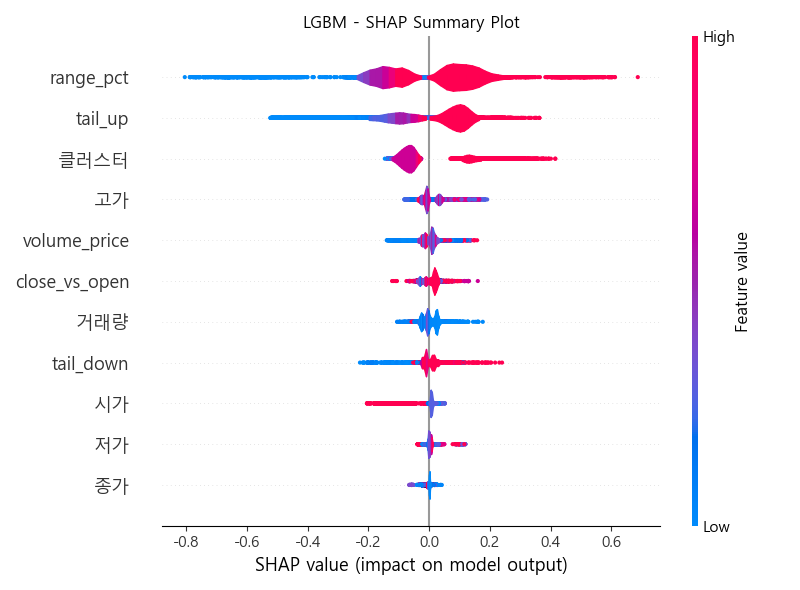
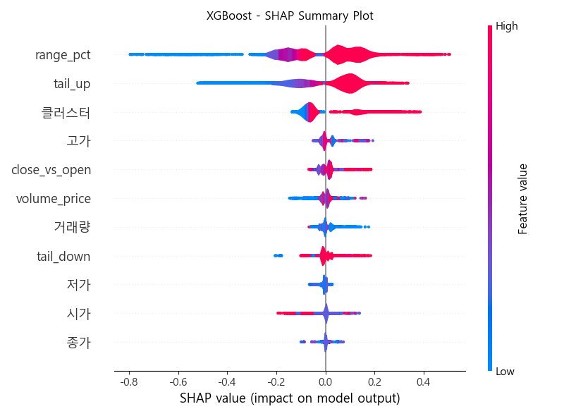
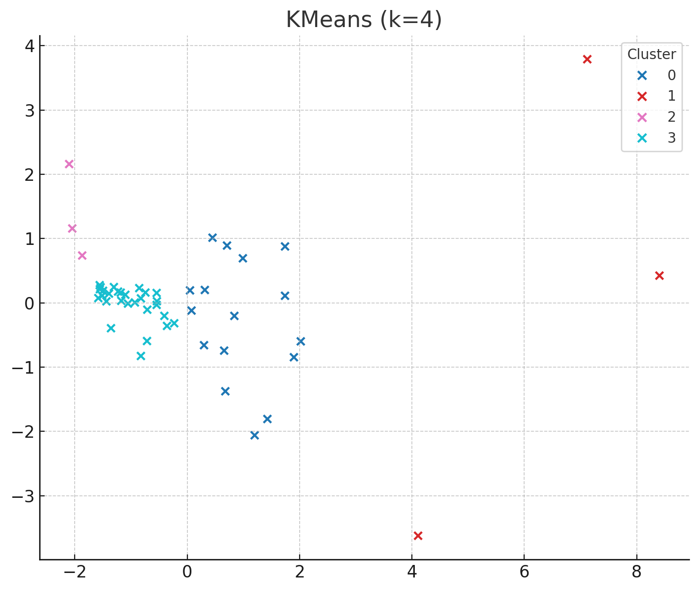

# 📈 Stock_Project

> 최근 KOSPI 주식 종목 중 저평가되었지만 급등 패턴을 보일 가능성이 높은 종목을 식별하기 위한 머신러닝 기반 주식 추천 알고리즘 프로젝트입니다.

---

## 🧠 프로젝트 개요

- KOSPI 시총 상위 50개 종목의 일별 데이터를 기반으로, **3일 후 수익률**을 예측하는 **지도 학습 모델**을 구축
- 다양한 머신러닝 모델(XGB, LGBM, LogisticRegression, SVM)을 앙상블(VotingClassifier)하여 **Top-N 추천 + 확률 Threshold 방식**을 비교 백테스트
- SHAP 분석을 통해 **주요 피처의 영향도 분석**
- 클러스터링(KMeans 기반)으로 유사한 종목 군집을 나눈 후, **클러스터별 수익률 통계 및 전략적 투자 기반 도출**

---

## 📂 폴더 구조 | Folder Structure

- `API_SET/`  
  네이버 증권 모바일 페이지를 기반으로 종목별 일자별 데이터를 크롤링하는 Python 스크립트  
  Python scripts for crawling daily stock data per ticker using Naver's mobile stock pages

- `Back_Test/`  
  LGBM, XGB, LR, SVM을 포함한 앙상블 모델의 3년치 롤링 윈도우 백테스트 코드  
  Rolling-window backtesting scripts for ensemble models (LGBM, XGB, LR, SVM) over 3 years

- `Back_Test_Result/`  
  백테스트에서 출력된 종목 추천 및 성과 지표 CSV 저장  
  CSV files with recommendations and performance metrics from backtesting results

- `Base_Model/`  
  단일 모델(LightGBM, XGBoost, Random Forest, CatBoost 등)의 비교 및 결과 저장용 스크립트  
  Scripts for testing and comparing single machine learning models (e.g., LightGBM, XGBoost, CatBoost)

- `CSV/`  
  시가총액 기준 상위 50개 종목의 원본 일별 주가 데이터 CSV  
  Raw daily stock price CSVs for the top 50 KOSPI companies by market cap

- `CSV_By_Date/`  
  벡테스트 위한 3년간 이상의 데이터를 (2022Y 3M 23D ~ 2025Y 6M 26D, 약 3년 이상) 일별로 모아둠  
  Collect more than 3 years of data (2022Y 3M 23D to 2025Y 6M 26D, about 3+ years) by day for backtesting

- `EDA_CSV/`  
  CSV 폴더에 매일 매일 생성된 데이터 중 주가 예측에 핵심인 요소들 뽑아서 재처리한 CSV 모음  
  A collection of CSVs in a CSV folder, in which we've extracted and reprocessed the data generated on a daily basis that is key to stock price forecasting

- `Supervised_Learning_CSV/`  
  K일간 수익률 예측을 위한 학습용 CSV 데이터셋  
  Training datasets formatted for supervised learning (e.g., 7-day future return prediction)

- `Total_Process/`  
  원시 데이터 전처리 → 클러스터링 → SHAP 분석까지 전체 파이프라인을 하나로 묶은 실험 기록  
  Complete pipeline from raw data processing to clustering and SHAP value interpretation

- `image/`  
  SHAP 분석 결과 시각화 이미지 저장 (모델별로 분리)  
  Visual outputs of SHAP feature importance plots for different models

---

## 📊 모델 성능 요약 (백테스트 결과)

- 실험 구간: 최근 3년
- 실험 방식: Rolling Window (학습 80일, 테스트 20일, Step 10일)

| 방식        | 평균 수익률 | 평균 정답률 | ROC AUC | PR AUC | 평균 선택 종목 수 |
|-------------|--------------|--------------|---------|--------|------------------|
| Top-1 추천   | 0.0564       | 0.6798       | 0.7412  | 0.6343 | 1.0              |
| Top-3 추천   | 0.0420       | 0.6113       | 0.7412  | 0.6343 | 3.0              |
| Threshold    | 0.0352       | 0.5213       | 0.7412  | 0.6343 | 5.23             |

> ※ 앙상블 모델: `XGB + LGBM + LR + SVM` (Soft Voting)

---

## 🔍 SHAP 분석 결과

| 모델 | Top 영향 피처 |
|------|----------------|
| XGBoost | `range_pct`, `tail_up`, `클러스터`, `close_vs_open` 등 |
| LGBM    | `range_pct`, `tail_up`, `클러스터`, `volume_price` 등 |

> `range_pct` (고가-저가 / 시가), `tail_up` (상단 꼬리 길이), `클러스터` 변수의 영향력이 지배적임

---

## 🧪 클러스터링 기반 분석 결과

- 클러스터 3번이 전체 대비 평균 수익률 및 10% 이상 상승 비율에서 가장 우수
- 실시간 추천 시 클러스터 3번에 속하는 종목을 우선적으로 고려하는 전략 가능

KMeans로 분류한 종목 군집은 다음과 같은 분포를 보입니다:

---

## 🎯 추가 목표

- 과거 **N일(7~10일 등)** 기준의 데이터를 기반으로 학습 → 매 거래일 **개장 전 실시간 Top 1~5 종목 추천**
- 해당 알고리즘을 **키움증권 모의투자 대회**에 실제 적용하여 수익률 검증
- 향후에는 **리밸런싱 주기(주간/월간)** 및 **교체 방식(수익률 하위 제외 등)** 을 포함한 자동 운용 로직 구현 예정

> ✅ **최종 목표:** 예측 알고리즘 + 실거래 기반 수익률 검증 + 운용 로직까지 결합된 통합 퀀트 시스템 구축

---

## 💡 사용 기술

- Python, pandas, scikit-learn, xgboost, lightgbm
- SHAP, KMeans, Matplotlib
- GitHub / VSCode / Git CLI

---

## 📬 문의

문의 및 피드백: [jamjamdonkey@github](https://github.com/jamjamdonkey)

